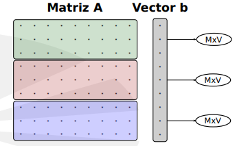

# Práctica 3 Paralelismo

## Descomposición de dominio

Dividid la matriz entre p procesos, cada uno con m = N/p filas (por
simplicidad, empezad con el caso en que consideraremos que el número
de procesos es m´ultiplo de N: N mod p = 0).

Cada tarea se encargará de calcular N/p filas del vector resultado.

En la entrega considerad cualquier número de procesos, no solo múltiplos
de N.

## Paralelización

* Implementación SPMD.
* La inicialización de la matriz la hace el proceso 0.
* Distribuir datos a todos los procesos con operaciones colectivas.
* Recolección del vector resultado con operaciones colectivas.
* La E/S (printf) la hace el proceso 0.
* Imprimid por separado tiempo de comunicaciones y tiempo computación
de cada proceso.
